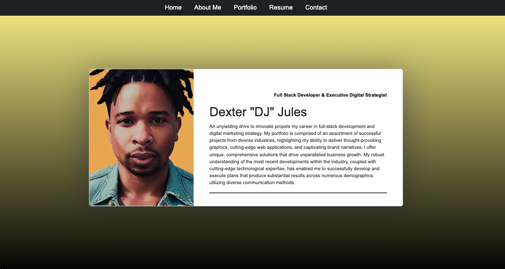

# Reactfolio 


## Description

This portfolio project was created using React, showcasing my skills, projects, and experiences. It serves as a platform to highlight my work and provide information about my background and achievements.

### Motivation

The motivation behind building this project was to have a central hub to showcase my portfolio and create a professional online presence. It allows me to demonstrate my skills, projects, and experiences to potential employers or clients.

### Problem Solved

This project solves the problem of effectively presenting my work and providing a comprehensive overview of my skills and accomplishments. It serves as a digital resume and a visual representation of my capabilities, making it easier for others to understand and evaluate my expertise.

### Learning Experience

During the development of this project, I gained valuable experience in using React and its associated libraries, such as React Router and React Bootstrap. I learned how to create reusable components, manage routing and navigation, and implement responsive designs. Additionally, I honed my skills in structuring and organizing a portfolio to effectively convey information and engage visitors.

## Table of Contents

- [Installation](#installation)
- [Usage](#usage)
- [License](#license)

## Installation

To run this project locally, please follow these steps:

1. Clone the repository to your local machine.
2. Navigate to the project directory.
3. Install the required dependencies by running the following command:

```shell
npm install
```

4. Once the installation is complete, start the development server:

```shell
npm start
```

5. Open your browser and visit `http://localhost:3000` to view the portfolio.

## Usage

To use the portfolio, follow these instructions:

1. Upon accessing the portfolio, you will see a homepage showcasing an overview of your projects and skills.
2. Navigate through the different sections to explore your projects, experiences, and other relevant information.
3. Use the navigation menu or any provided links to access specific sections or external resources.
4. Customize the portfolio by modifying the source code and adding your own projects, experiences, or any other desired content.
5. Feel free to adapt the design and structure to suit your preferences and personal branding.

Deploy link: https://teal-pika-9bf5ba.netlify.app/ 

## Screenshots

Include relevant screenshots of your portfolio project here, showcasing different sections or notable features.

Desktop Version:





Site is fully responsive (check the mobile on console)

## Dependencies

This project utilizes the following dependencies:

- Bootstrap: "^5.2.3"
- React: "^18.2.0"
- React Bootstrap: "^2.7.4"
- React DOM: "^18.2.0"
- React Router DOM: "^6.11.2"

## License

This project is licensed under the MIT License. See the [LICENSE](LICENSE) file for more details.
